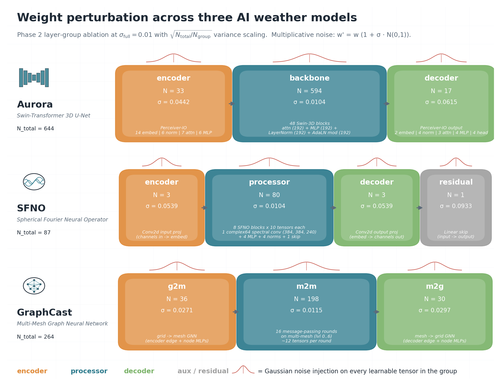
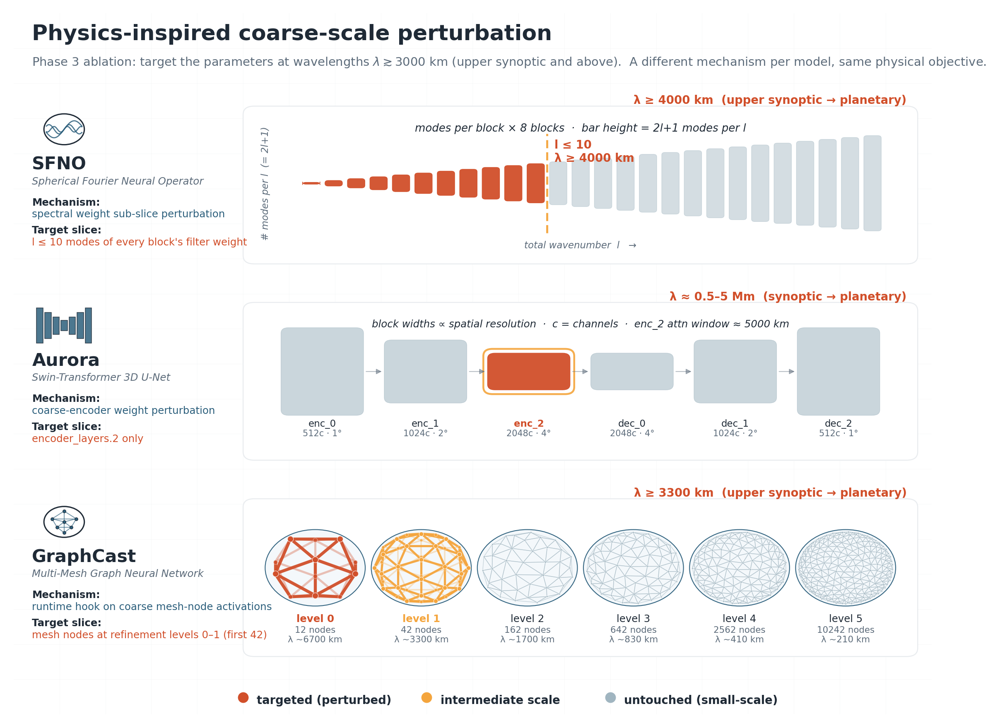

# AI Model Ensembles for Weather Forecasting

Compare AI weather forecast models — GraphCastOperational, SFNO, Aurora
(deterministic, with post-training weight perturbation) against FCN3, Atlas
(probabilistic) and the on-disk IFS ENS physical baseline. AI models are
initialised from ARCO ERA5; IFS ENS is verified directly.
Verification via
[SwissClim Evaluations](https://github.com/swiss-ai/SwissClim_Evaluations).

This repo is a thin orchestration layer over [NVIDIA earth2studio](https://github.com/NVIDIA/earth2studio):

- **earth2studio** handles model loading, IC fetching, and rollout.
- **swissclim-evaluations** handles deterministic + probabilistic
  verification, plotting, and intercomparison.
- This repo wires them together: a curated 7-model registry, IC + weight
  perturbation helpers, Slurm scripts, and a GH200 container build.

## Model registry

| Model | Class | Resolution | Step | Role |
|---|---|---|---|---|
| `graphcast_operational` | `GraphCastOperational` | 0.25° | 6 h | deterministic, weight-perturbed |
| `sfno` | `SFNO` (FCNv2) | 0.25° | 6 h | deterministic, weight-perturbed |
| `aurora` | `Aurora` | 0.25° | 6 h | deterministic, weight-perturbed |
| `aifs` | `AIFS` (v1) | 0.25° | 6 h | deterministic, weight-perturbed |
| `fcn3` | `FCN3` | 0.25° | 6 h | probabilistic, re-seeded per member |
| `atlas` | `Atlas` | 0.25° | 6 h | probabilistic, re-seeded per member |
| `aifsens` | `AIFSENS` (v1) | 0.25° | 6 h | probabilistic, re-seeded per member |

`ai-ens models` prints the live registry. Adding a model means appending one
`ModelSpec` in [ai_models_ensembles/e2s_models.py](ai_models_ensembles/e2s_models.py).

## Perturbation strategy

Weight perturbation is applied in four ablation phases, each progressively
more physically-motivated.

### Phase 2 — architectural layer groups

Per model, partition the learnable weights into encoder / processor /
decoder groups (model-specific naming). Apply Gaussian multiplicative
noise to a single group at a time, with `sqrt(N_total / N_partial)`
variance scaling so the partial-group output spread matches the full-weight
reference at `σ_full = 0.01`.



### Phase 3 — physics-inspired coarse-scale targeting

Perturb only the parameters/activations responsible for
upper-synoptic-and-above spatial scales (`λ ≳ 3000 km`, per the SwissClim
band conventions: synoptic 1–5 Mm, planetary 5–20 Mm). Each model uses a
different mechanism for the same physical objective:

- **SFNO** — sub-axis slice perturbation of the spherical-harmonic
  spectral conv weights at `l ≤ L_cut` (CLI flag `--coarse-mode-cut N`).
  Perturbs only `W[..., :N]` of the 8 `*.filter.filter.weight` tensors
  (dhconv operator, 240-mode axis is the total wavenumber l directly;
  confirmed by runtime diagnostic). Phase 3 anchor `L_cut=10`
  (`λ ≥ 4000 km`). Optional flag `--coarse-mode-skip-first K` excludes
  the K lowest modes (e.g. K=1 leaves `l=0` untouched -- `l=0` is the
  global constant and mass-conservation-bound for fields like surface
  pressure, so perturbing it can spuriously inflate global-mean spread
  on rollout).
- **Aurora** — perturb the deepest Swin-3D downsampling block of the
  U-net backbone, `net.backbone.encoder_layers.2.*` (96 tensors,
  indices 494:590; named group `unet_bottom`). Operates on ~450 km
  tokens with a Swin attention-window receptive field of ~5000 km,
  reaching synoptic-to-planetary scales. The decoder side was dropped
  after Phase 2 evidence that encoder perturbation produces much larger
  ensemble spread than decoder.
- **GraphCast** — runtime activation hook on coarse mesh-node features:
  after the grid2mesh encoder, the latent features of the first 42 mesh
  nodes (icosahedral refinement levels 0+1, ~3300 km separation) are
  multiplied by `(1 + σ × N(0,1))`. Implementation monkey-patches
  `graphcast.GraphCast` with a subclass before model load.

Phase 3 is run as a **per-model σ sweep at fixed scale threshold**
because the sqrt(N) baseline alone produced near-zero spread for
SFNO/Aurora (backbone-robustness inherited from Phase 2) and would have
destroyed the forecast for GraphCast. Final per-model σ is chosen
empirically from the cross-phase intercomparison plots
(`phase3/<model>/intercomparison/`).



### Phase 2b — sigma sweep around Phase 2 winners

Phase 2b brackets each model's Phase 2 winning layer group with 4 extra
sigma points (e.g. Aurora encoder {0.025, 0.060}; GraphCast g2m {0.014,
0.045}; SFNO encoder {0.035, 0.080}) to characterize the CRPS-vs-σ curve
near the SSR=1 crossing. Outputs at `phase2b/<model>/intercomparison/`.

### Phase 3b — orthogonal threshold sweep at sqrt(N) σ

Phase 3 varies σ at fixed scale threshold. Phase 3b is the orthogonal
ablation: it varies the **scale threshold** at the per-(model, threshold)
sqrt(N) σ, holding the variance budget constant. Tests whether broader
spatial reach at modest σ is more effective than narrow reach at high σ
(especially relevant for Aurora's backbone-robustness regime).

Wavelength bins aligned across models:

| λ bin | SFNO | Aurora | GraphCast |
|---|---|---|---|
| ~3000–5000 km (Phase 3 anchor) | L_cut=10, σ=0.049 | `unet_bottom`, σ=0.026 | level 0+1 (42 nodes), σ=0.312 |
| ~2000 km | L_cut=20, σ=0.035 | `enc_12`, σ=0.017 | level 0+1+2 (162 nodes), σ=0.159 |
| ~800–1000 km | L_cut=40, σ=0.025 | `enc_012`, σ=0.015 | level 0+1+2+3 (642 nodes), σ=0.080 |

Each σ is `0.01 × √(N_total / N_partial)` for that (model, threshold).
Aurora named groups `enc_12` = encoder_layers.{1,2} and `enc_012` =
encoder_layers.{0,1,2}; defined in
[`_MODEL_LAYER_GROUPS["aurora"]`](ai_models_ensembles/e2s_perturbation.py).
Phase 3b cross-intercomp pulls Phase 1 `mag_0` + Phase 1 `mag_0.01` +
Phase 2 winner + Phase 3 sqrt(N) anchor + the 2 Phase 3b rows.

Tensor counts, channel dimensions, group definitions and the 240-mode
layout were verified empirically from checkpoint dumps + a runtime
diagnostic ([tools/dump_*_keys.py](tools/),
[tools/diagnose_sfno_modes.py](tools/diagnose_sfno_modes.py)).

### Production baselines (per-model picks, carried to the 112-init grid)

| Model | Mechanism | Layer/scale | σ | Run tag |
|---|---|---|---|---|
| Aurora | layer_group | `encoder` (input projection) | 0.025 | `aurora_encoder` |
| GraphCast | layer_group | all weights | 0.01 | `graphcast_all` |
| SFNO | coarse_modes | spectral degree `l < 10` | 0.25 | `sfno_modes10` |
| AIFS | layer_group | `decoder` | 0.0275 | `aifs_perturbed` |

### Baseline intercomparison (112-init grid)

The four production baselines run against the trained-probabilistic
`atlas` / `fcn3` / `aifsens` and the physical `ifs_ens` on the full
112-init grid (`$STORE/baselines/<id>/`). See the paper for the headline
numbers; earlier interim tables predated the full grid and are dropped.

## Initial conditions

All AI models start from **ARCO ERA5** by default. Reasons:

- All were trained on ERA5; ERA5 ICs are in-distribution.
- The on-disk IFS download ([sadamov/ifs_download](https://github.com/sadamov/ifs_download))
  doesn't include the t+0 analysis or the full variable list any of these
  models need (missing `u100m`, `v100m`, `sp`, `tcwv`, `w`, `sst`,
  accumulated fluxes; missing 600 hPa).
- The IFS ENS forecast on disk plays the role of the physical baseline; it's
  plugged directly into SwissClim verification, not re-initialised.

To use a different IC source, pass `--data-source` to `ai-ens infer` or
edit the constant at the top of the relevant slurm script:
`arco | cds | gfs | ifs | ifs_ens | wb2 | file:/path | ifs_analysis:/path`.
The `ifs_analysis:` source is still wired up (extracts `lead_time=0` from a
SwissClim-format IFS zarr) for the day you have a download with t+0 analysis
and the full variable set.

### IFS-ENS-perturbed-IC experiment (Phase 5)

The post-hoc weight-perturbation baselines re-use the same ERA5 IC across all
ensemble members. The Phase 5 hybrid run instead initialises ensemble member
`k` from IFS-ENS perturbed-analysis member `k` (the 50-member EDA-perturbed
analyses, `stream=enfo type=pf step=0`), adding **real physical IC
perturbations** on top of the existing weight perturbation. Pass the IC store
with `--ic-zarr`:

```bash
ai-ens infer --model graphcast_operational --init 2024-02-15T00:00 \
   --lead-hours 240 --members 10 --weight-magnitude 0.01 --layer all \
   --ic-zarr /capstor/store/cscs/swissai/a122/IFS/ifs_analysis_perturbed_ic.zarr \
   --output $STORE/test/gc_ic/forecast.zarr
```

`--ic-zarr` selects `ensemble=member_id` from the store and serves it as the
IC (overriding `--data-source` and `--ic-magnitude`); combine it with
`--weight-magnitude` for the hybrid. The store carries 224 6-hourly init times
(8 weeks × 28 samples, including the `t-6h` slot autoregressive models need)
and 50 members. Two PL levels (150, 600 hPa) are not archived for `type=pf
step=0`, so they are filled by log-pressure interpolation
(`fill_interp_levels.py`); the download writes MARS short names, which
[tools/rename_ic_to_swissclim.py](tools/rename_ic_to_swissclim.py) renames to
SwissClim long names so `from_swissclim` maps them to the earth2studio lexicon.

## Quickstart

The heavy ML stack (`torch`, `earth2studio`, `jax`, model-specific deps) lives
inside per-model containers under [containers/](containers/). The host venv
holds only what's needed for editor support, slurm orchestration, and
post-hoc analysis of zarr outputs.

1. Build the per-model container(s)

```bash
bash containers/submit_build.sh <model|all>    # writes $STORE/<model>.sqsh
```

2. (Optional) Minimal host venv for editor / scripting

```bash
# Place the venv on persistent capstor store (scratch purges it) and symlink into the repo
VENV_DIR=/capstor/store/cscs/mch/s83/sadamov/venvs/ai-models-ensembles
uv venv --python 3.11 "$VENV_DIR"
ln -s "$VENV_DIR" .venv
source .venv/bin/activate

uv pip install \
  "typer>=0.12" "rich>=13.0" \
  "zarr>=3.0" "xarray>=2024.10" dask numcodecs \
  "numpy>=2.0" pandas matplotlib \
  "pyyaml>=6.0" netCDF4 cfgrib \
  "pytest>=8.0" "ruff>=0.6" "pre-commit>=3.7" ipython
uv pip install -e . --no-deps
```

`earth2studio`, `swissclim-evaluations`, `torch`, `jax`, etc. are
deliberately not installed on the host - run anything that needs them inside
a container via `srun --container-image=$STORE/<model>.sqsh ...`.

3. List available models (works on the host venv)

```bash
ai-ens models
```

4. Submit inference and evaluation jobs

```bash
bash scripts/submit_all_inference.sh                          # all baselines (trained + perturbation)
bash scripts/submit_all_inference.sh aurora_encoder           # single baseline
PER_INIT=1 bash scripts/submit_all_inference.sh sfno_modes10  # one sbatch per init (multi-GPU SIGSEGV escape hatch)
bash scripts/submit_ablation.sh {phase1|phase2|phase2b|phase3|phase3b} [model]   # weight-perturbation ablation
bash scripts/evaluate_baselines.sh all [model]                                   # per-module eval (default; 7 sbatch per model)
bash scripts/evaluate_baselines.sh intercompare                                  # cross-model baseline intercomp
bash scripts/evaluate_ablation.sh {phase1|phase2|phase2b|phase3|phase3b} [model] # SwissClim verification
bash scripts/evaluate_ablation.sh intercompare {phase1|phase2|phase2b|phase3|phase3b} [model]
bash scripts/evaluate_ablation.sh allphases_intercompare [model]                 # cross-phase summary
```

Note: `evaluate_baselines.sh all` always submits per-module (one sbatch per
(model, module), --mem=800G --time=12:00:00). At 112 inits the legacy bundled
main eval consistently exceeded the 12 h walltime, so the per-module split is
the only reliable path. Use `bundled-main` / `bundled-etsfss` actions as
legacy escape hatches if you really want the single-job behaviour.

`allphases_intercompare` produces the final cross-phase ablation summary
(one intercomp per model showing the argmin-CRPS winner from each of the
five phases side-by-side, with the `mag_0` unperturbed reference). Writes
to `$STORE/ablation/allphases/<model_id>/intercomparison/`. Per-phase
winner tags are hardcoded in `evaluate_ablation.sh:ALLPHASES_PHASE{1,2,2c,3,3b}`.

The `intercompare` action pulls Phase 1 `mag_0_layer_all` (unperturbed)
and `mag_0.01_layer_all` (Phase 1 best) as reference panels for phase2+;
phase3 and phase3b also pull the Phase 2 winner per model (configured via
`PHASE2_BEST_TAG`), and phase3b additionally pulls the Phase 3 sqrt(N)
anchor per model (`PHASE3_SQRTN_TAG`), both at the top of
`scripts/evaluate_ablation.sh`.

See [scripts/README.md](scripts/README.md) for the full submitter docs.
Per-run parameters are constants at the top of each script - there is no
shared `config.sh`.

## Requirements

- Linux. Slurm + pyxis + enroot recommended for GH200.
- GPU (CUDA 12.x).
- For `arco` / `wb2` data sources: outbound HTTPS to GCS.
- For `cds`: `~/.cdsapirc` credentials.
- `envsubst` (gettext-base) for SwissClim YAML rendering.
- `podman` + `enroot` if building the container.

## CLI usage (Typer)

```bash
ai-ens --help
ai-ens models           # list available earth2studio models
```

All of the following must run inside a container (they need
`earth2studio`). Wrap each in `srun --container-image=$STORE/<model>.sqsh ...`.

```bash
# Single deterministic forecast
ai-ens infer --model graphcast_operational --init 2024-02-15T00:00 \
   --lead-hours 240 --members 1 --data-source arco \
   --output $STORE/test/gc_op/forecast.zarr

# 10-member IC-perturbed ensemble
ai-ens infer --model sfno --init 2024-02-15T00:00 --lead-hours 240 \
   --members 10 --ic-magnitude 0.005 --data-source arco \
   --output $STORE/test/sfno_ic/forecast.zarr

# 10-member weight-perturbed ensemble (per-member NGC mirror)
ai-ens infer --model graphcast_operational --init 2024-02-15T00:00 \
   --lead-hours 240 --members 10 --weight-magnitude 0.01 --layer all \
   --data-source arco --output $STORE/test/gc_w01/forecast.zarr

# Verification (delegates to swissclim-evaluations)
ai-ens verify --config /abs/path/to/swissclim_eval.yaml

# Intercompare a set of swissclim_* output roots
ai-ens intercompare /path/A/swissclim_graphcast_operational \
                    /path/B/swissclim_sfno \
                    /path/C/swissclim_aurora \
                    --label GC --label SFNO --label Aurora
```

`--layer` accepts a single weight-tensor index, a `start:end` range,
fractional `0.0:0.33`, named architectural groups, or `all`. The named
groups are model-specific (defined in `_MODEL_LAYER_GROUPS` in
[ai_models_ensembles/e2s_perturbation.py](ai_models_ensembles/e2s_perturbation.py)):

| Model | Named groups |
|---|---|
| `aurora` | `encoder`, `backbone`, `decoder` |
| `graphcast_operational` | `g2m`, `m2m`, `m2g` |
| `sfno` | `encoder`, `processor`, `decoder`, `residual` |
| `aifs` | `encoder`, `processor`, `decoder` |

The slurm submitters in `scripts/` hard-code their per-experiment defaults
and pass them through `ai-ens infer ...`.

## Zarr format

Inference and verification both speak the SwissClim Evaluations schema:

- dims: `(init_time, lead_time, ensemble, latitude, longitude[, level])`
- `init_time` is `datetime64[ns]`, `lead_time` is `timedelta64[ns]`
- `level` is integer hPa (only on 3D variables)
- variables use ECMWF long names (`10m_u_component_of_wind`, `2m_temperature`,
  `temperature`, `u_component_of_wind`, `geopotential`, ...)

The bridge from earth2studio output to SwissClim is in
[ai_models_ensembles/swissclim_format.py](ai_models_ensembles/swissclim_format.py)
(`e2s_to_swissclim`, exercised by
[tests/test_swissclim_format.py](tests/test_swissclim_format.py)).

## Outputs

```text
$STORE/
  ├─ baselines/
  │  ├─ {fcn3,atlas,aifsens,ifs_ens}/                       # trained probabilistic baselines
  │  ├─ {aurora_encoder,graphcast_all,sfno_modes10}/        # post-hoc perturbation baselines
  │  │  └─ <YYYYMMDD_HHMM>/forecast.zarr
  │  └─ intercomparison/                                    # cross-model plots
  └─ ablation/
     ├─ <phase>/<model_id>/                                 # phase in {phase1,phase2,phase2b,phase3,phase3b}
     │  ├─ <init_tag>/<run_tag>/forecast.zarr               # per-run forecast
     │  ├─ eval/<run_tag>/                                  # SwissClim eval modules
     │  │  ├─ maps/  wd_kde/  energy_spectra/  multivariate/
     │  │  └─ deterministic/  probabilistic/  ets/  fss/  ssim/
     │  └─ intercomparison/                                 # per-phase cross-run plots
     └─ allphases/<model_id>/intercomparison/               # cross-phase ablation summary
```

## Containers (GH200)

One container per model lives under [containers/](containers/), each pinned
to the deps that model actually needs:

```bash
bash containers/submit_build.sh <model|all> [partition]
# writes $STORE/<model>.sqsh for: aurora, graphcast, sfno, fcn3, atlas, aifsens
```

Base images are NGC PyTorch 25.12 (or 26.01 for `atlas`). Inside the
container, run with the bind-mounted source via
`python -m ai_models_ensembles.cli ...` (the baked-in `ai-ens` entrypoint
uses the image's installed package).

## Architecture

- **`ai_models_ensembles/cli.py`** - Typer CLI (`infer`, `verify`,
  `intercompare`, `models`)
- **`ai_models_ensembles/e2s_models.py`** - registry of earth2studio
  prognostic models with step_hours and probabilistic flag
- **`ai_models_ensembles/e2s_data.py`** - DataSource adapters: factory for
  `ARCO/CDS/GFS/IFS/IFS_ENS/WB2/file:`, plus `XarrayDataSource` for
  in-memory perturbed ICs
- **`ai_models_ensembles/e2s_perturbation.py`** - multiplicative IC noise +
  generic weight-perturbation walker (`.npz / .pt / .pth / .ckpt /
  .safetensors`)
- **`ai_models_ensembles/e2s_inference.py`** - inference driver that handles
  all four perturbation combinations and writes SwissClim-format zarr
- **`ai_models_ensembles/swissclim_format.py`** - schema bridge
  (`e2s_to_swissclim`, `to_swissclim_forecast`, `to_swissclim_target`)
- **`config/`** - SwissClim YAML template + intercomparison config
- **`scripts/`** - Slurm submitters for inference and SwissClim eval
- **`containers/`** - per-model Dockerfiles and `submit_build.sh`
- **`tools/`** - host venv helpers, weight inspection, zarr resharding; `tools/milton/` holds the Hurricane Milton case-study pipeline (TC tracking + figures)
- **`figures/`** - perturbation schematics (regenerable SVG/PDF/PNG)

## Pre-commit & Ruff

```bash
pre-commit install
pre-commit run --all-files
```

Hooks: Ruff lint + format, end-of-file fixer, trailing-whitespace cleanup,
merge-conflict checks. `ruff` and `pre-commit` are part of the minimal host
venv install above.

## Testing

```bash
pytest -q
```

The repo's unit tests cover only the schema bridge and CLI loadability;
inference + perturbation are exercised end-to-end on a GPU node.

## Troubleshooting

- **`import earth2studio` fails on the host**: expected. `earth2studio` and
  the model deps only live inside containers; the host venv is intentionally
  minimal. Run inside `$STORE/<model>.sqsh` via `srun --container-image=...`.
- **CDS data source fails**: needs `~/.cdsapirc`. Prefer `arco` for ERA5.
- **`envsubst: command not found`**: install `gettext-base`.
- **Container build fails**: must be submitted to a compute node via
  `containers/submit_build.sh`; the login nodes can't build.
- **Numpy 2 incompatibility**: pin in `pyproject.toml`. earth2studio and
  swissclim both require `numpy >= 2`.
